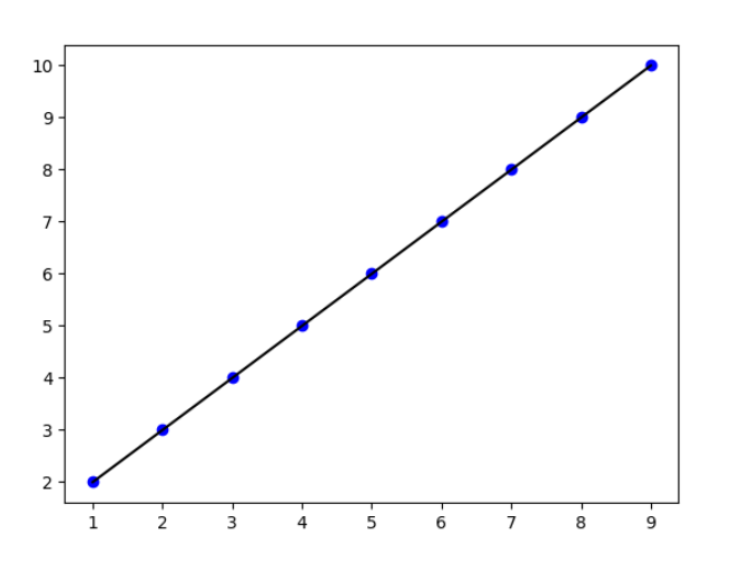

# Implementation of Univariate Linear Regression
## Aim:
To implement univariate Linear Regression to fit a straight line using least squares.
## Equipment’s required:
1.	Hardware – PCs
2.	Anaconda – Python 3.7 Installation / Moodle-Code Runner
## Algorithm:
1.	Get the independent variable X and dependent variable Y.
2.	Calculate the mean of the X -values and the mean of the Y -values.
3.	Find the slope m of the line of best fit using the formula.
 
4.	Compute the y -intercept of the line by using the formula:
  
5.	Use the slope m and the y -intercept to form the equation of the line.
6.	Obtain the straight line equation Y=mX+b and plot the scatterplot.
## Program
```
# Developed by: Thanushree M
# Register no: 24900590
import numpy as np
from matplotlib import pyplot
x=np.array(eval(input()))
y=np.array(eval(input()))
Xmean=np.mean(x)
Ymean=np.mean(y)
num,den=0,0
for i in range(len(x)):
    num+=(x[i]-Xmean)*(y[i]-Ymean)
    den+=(x[i]-Xmean)**2
slope=num/den
c=Ymean-slope*Xmean
y_per=slope*x+c
pyplot.scatter(x,y,color='blue')
pyplot.plot(x,y_per,color='black')
pyplot.show()


```
## Output

## Result
Thus the univariate Linear Regression was implemented to fit a straight line using least squares.
